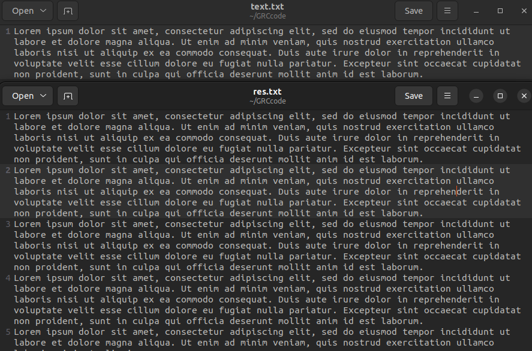

# 文件结构（GRC 文件）

## Transceiver

样本点测距法发端，在 915MHz 循环发送固定数据，同时在 2GHz 接收数据，并存储本地。

## Transponder

样本点测距法收端，将 915MHz 接收到的数据不做处理直接在 2GHz 转发。

## bpsk_test

自组数据帧实现基于 BPSK 的文本传输，文本从文件中获取，数据帧结构为`| access_code | pkt_len | pkt_len | payload |`，使用[Correlate Access Code - Tag Stream](https://wiki.gnuradio.org/index.php/Correlate_Access_Code_-_Tag_Stream)模块提取 payload，并转换回文本存储本地。

## bpsk_succ

自组数据帧在 Pluto SDR 设备上实现物理信道传输文本。

## pic_frame & pic_frame_sdr

使用 GNU Radio 的[Protocol Formatter](https://wiki.gnuradio.org/index.php/Protocol_Formatter)及 digital 接口（[Python](https://www.gnuradio.org/doc/sphinx-3.7.3/digital/index.html#module-gnuradio.digital)/[C++](https://www.gnuradio.org/doc/doxygen-v3.10.9.1/group__packet__operators__blk.html)）程序化组帧传输图片。

## text_frame & text_frame_sdr

使用[Protocol Formatter](https://wiki.gnuradio.org/index.php/Protocol_Formatter)传输文本。

# 效果图

## 文本传输

## 图像传输

